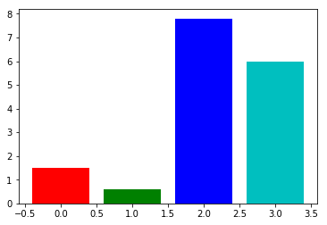
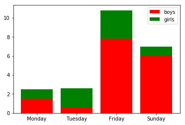

## 柱状图实战


```python
%matplotlib inline
```


```python
import matplotlib.pyplot as plt
```

#### 普通柱状图实战：简单柱状图 数据[1.5,0.6,7.8,6]


```python
import matplotlib.pyplot as plt

num_list =[1.5,0.6,7.8,6]
plt.bar(range(len(num_list)), num_list)
plt.show
```


    <function matplotlib.pyplot.show(*args, **kw)>


#### 设置柱子颜色


```python
import matplotlib.pyplot as plt

num_list =[1.5,0.6,7.8,6]
plt.bar(range(len(num_list)), num_list, color ='rgbc')
plt.show()
```





#### 设置标签


```python
import matplotlib.pyplot as plt

name_list=["Monday","Tuesday","Friday", "Sunday"]
num_list =[1.5,0.6,7.8,6]
plt.bar(range(len(num_list)), num_list, color ='rgbc', tick_label = name_list)
plt.show()
```


#### 堆叠柱状图


```python
import matplotlib.pyplot as plt

name_list=["Monday","Tuesday","Friday", "Sunday"]
num_list =[1.5,0.6,7.8,6]
num_list2 =[1, 2, 3, 1]
plt.bar(range(len(num_list)), num_list, color ='r', tick_label = name_list, label ='boys')
plt.bar(range(len(num_list)), num_list2, color ='g', tick_label = name_list, bottom = num_list, label='girls')
plt.legend(loc="best")
plt.show()
```





#### 横向条形图


```python
import matplotlib.pyplot as plt

name_list=["Monday","Tuesday","Friday", "Sunday"]
num_list =[1.5,0.6,7.8,6]
plt.barh(range(len(num_list)), num_list, color ='rgbc', tick_label = name_list)
plt.show()
```


#### 并列柱状图


```python
import matplotlib.pyplot as plt

name_list=["Monday","Tuesday","Friday", "Sunday"]
num_list =[1.5,0.6,7.8,6]
num_list2 =[1, 2, 3, 1]

x =list(range(len(num_list)))

total_width = 0.8
n =2
width = total_width / n 

plt.bar(x, num_list, width = width, label='boys')

for i in range(len(x)):
    x[i] = x[i] + width
    
plt.bar(x, num_list2, width = width, label='girls',tick_label = name_list)
plt.legend(loc="best")
plt.show()
```


#### 饼状图实战


```python
import matplotlib.pyplot as plt
plt.rcParams['font.sans-serif']=['SimHei'] #用来正常显示中文标签

labels = 'A','B','C','D'
sizes = [10,20,30,40]

plt.pie(sizes, labels = labels)
plt.title('简单饼状图')
plt.show()
```


#### explode参数：一块饼图到中心的距离，默认为0


```python
import matplotlib.pyplot as plt
plt.rcParams['font.sans-serif']=['SimHei'] #用来正常显示中文标签

labels = 'A','B','C','D'
sizes = [10,20,30,40]
explode = (0, 0.2, 0, 0)
plt.pie(sizes, labels = labels, explode = explode)
plt.title('简单饼状图')
plt.show()
```


#### colors：数组，可选参数，默认为：None；用来标注每块饼图的matplotlib颜色参数序列。


```python
import matplotlib.pyplot as plt
plt.rcParams['font.sans-serif']=['SimHei'] #用来正常显示中文标签

labels = 'A','B','C','D'
sizes = [10,20,30,40]
explode = (0, 0.2, 0, 0)
colors=['r', 'g','b','c']
plt.pie(sizes, labels = labels, explode = explode, colors = colors)
plt.title('简单饼状图')
plt.show()
```


#### autopct ：控制饼图内百分比设置,可以使用format字符串或者format function；


```python
import matplotlib.pyplot as plt
plt.rcParams['font.sans-serif']=['SimHei'] #用来正常显示中文标签

labels = 'A','B','C','D'
sizes = [10,20,30,40]
explode = (0, 0.2, 0, 0)
colors=['r', 'g','b','c']
# plt.pie(sizes, labels = labels, explode = explode, colors = colors, autopct = '%1.1f')
plt.pie(sizes, labels = labels, explode = explode, colors = colors, autopct = '%1.2f%%')
plt.title('简单饼状图')
plt.show()
```


#### x：每一块饼图的比例，为必填项，如果sum(x)>1，会将多出的部分进行均分；


```python
import matplotlib.pyplot as plt
plt.rcParams['font.sans-serif']=['SimHei'] #用来正常显示中文标签

labels = 'A','B','C','D'
sizes = [0.1, 0.2, 0.3, 0.2]
explode = (0, 0.2, 0, 0)
colors=['r', 'g','b','c']
# plt.pie(sizes, labels = labels, explode = explode, colors = colors, autopct = '%1.1f')
plt.pie(sizes, labels = labels, explode = explode, colors = colors, autopct = '%1.2f%%')
plt.title('简单饼状图')
plt.show()
```


#### 添加图例，plt.legend( )


```python
import matplotlib.pyplot as plt
plt.rcParams['font.sans-serif']=['SimHei'] #用来正常显示中文标签

labels = 'A','B','C','D'
sizes = [10,20,30,40]
explode = (0, 0.1, 0, 0)
colors=['r', 'g','b','c']
# plt.pie(sizes, labels = labels, explode = explode, colors = colors, autopct = '%1.1f')
plt.pie(sizes, labels = labels, explode = explode, colors = colors, autopct = '%1.2f%%')
plt.title('简单饼状图')
plt.legend(loc="upper right", fontsize = 8, borderaxespad= 0.3)
plt.show()
```


